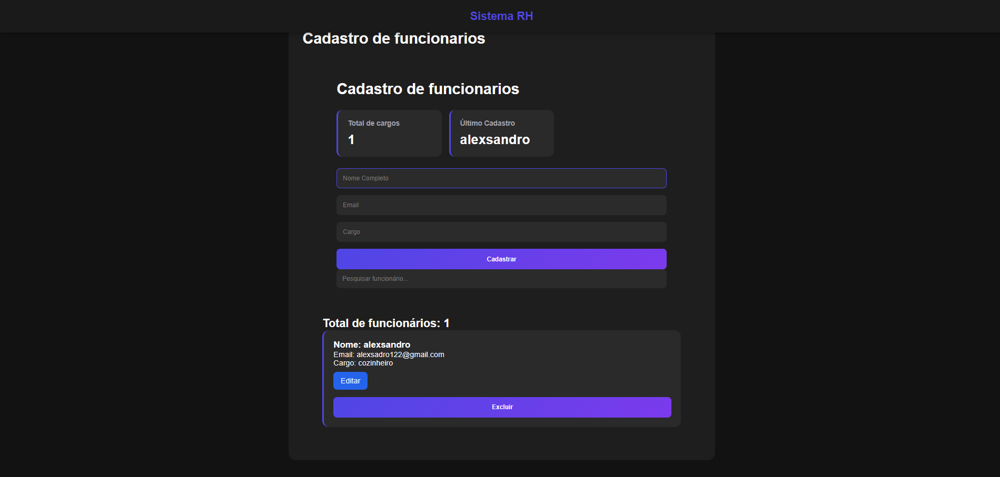
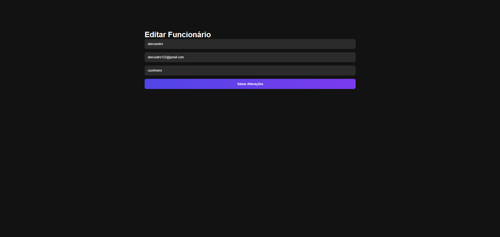

# Sistema RH com Flask

Sistema de gerenciamento de funcionários desenvolvido com Flask, SQLite, HTML, CSS e JavaScript.

---

## 🚀 Funcionalidades

- Cadastro de funcionários
- Edição de funcionários
- Exclusão de funcionários
- Sistema de login
- Dashboard
- Pesquisa de funcionários
- Sessão de usuário
- Interface moderna

---

## 🛠 Tecnologias utilizadas

- Python
- Flask
- SQLite
- HTML5
- CSS3
- JavaScript

---

## 📸 Screenshots

### Login


### Dashboard


### Editar Funcionário


---

## ▶ Como executar

### Instalar dependências

```bash
pip install -r requirements.txt
```

### Executar sistema

```bash
python app.py
```

---

## 👨‍💻 Autor

Desenvolvido por Alexsandro Rocha